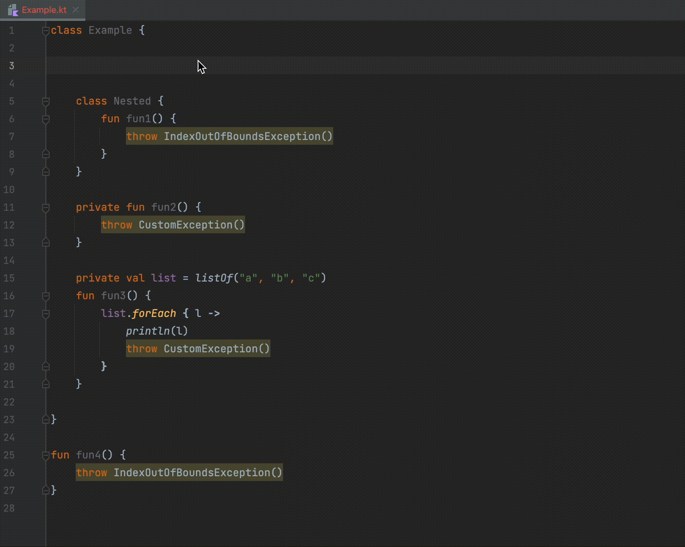

# Exception inspections IDEA plugin

## About project
It is the simple IDEA plugin **for Kotlin** which shows inspection in all places in code where exceptions are thrown
(e.g. throw IOException("Can't read file")). 

## Run plugin
0. Install JDK 17, Gradle
1. `./gradlew runIde`
2. Choose Kotlin project in opened IDEA window. (Test project `./ExceptionInspectionTestProject` can be used.)

## How it looks like

